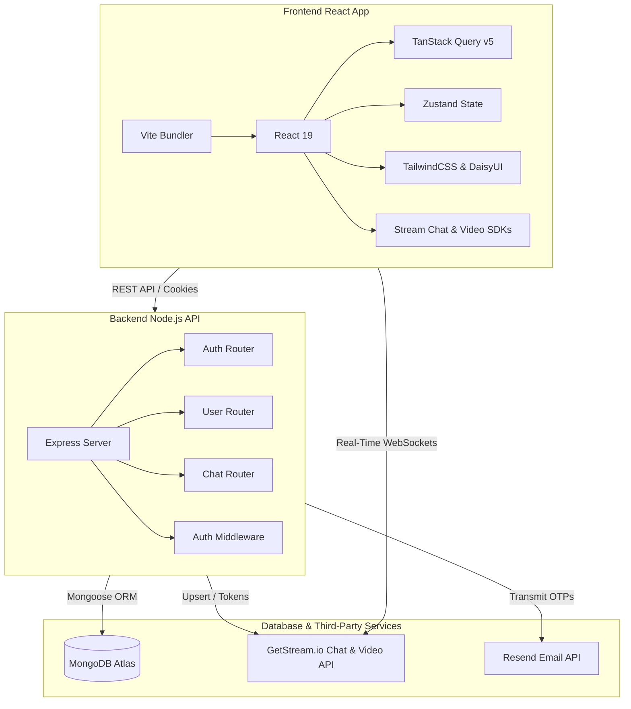
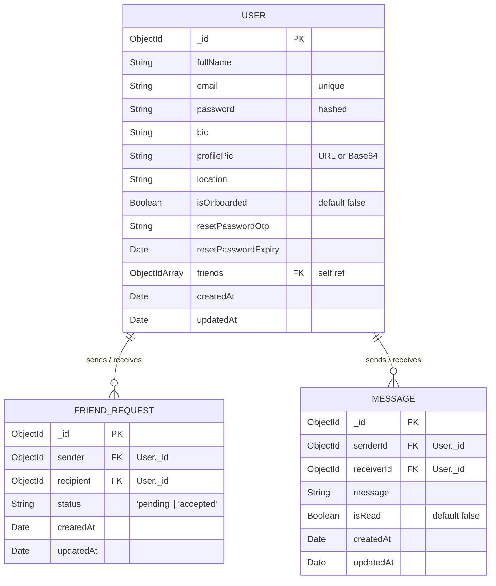

# Project Analysis: Converse Chat & Calling Application

This document provides a deep, comprehensive architectural analysis and breakdown of the Converse application. It covers the frontend, backend, APIs, database, authentication, routing, and deployment structure.

---

## 1. Architectural Overview

Converse is built as a modern, real-time communication platform offering secure instant messaging and high-definition video calling. The project uses a **monorepo architecture** split into two primary layers:



*   **Frontend (c:\Users\Tapan\Desktop\Converse\frontend)**: A React 19 single-page application (SPA) optimized by Vite. Real-time chat functionality and video stream calling are powered by GetStream.io react SDKs (`stream-chat-react` & `@stream-io/video-react-sdk`).
*   **Backend (c:\Users\Tapan\Desktop\Converse\backend)**: A stateless Node.js / Express REST API. Mongoose acts as the ORM to interact with MongoDB. Cookies are used to maintain JWT-based HTTP-only session tokens.
*   **Services**: 
    *   **GetStream.io**: Handles low-latency messaging, presence, thread management, and WebRTC video call sessions directly from the client.
    *   **Resend**: Dispatches high-deliverability password recovery OTP emails.

---

## 2. Tech Stack

| Layer | Technology | Purpose |
| :--- | :--- | :--- |
| **Core Frontend** | React 19.0.0, Vite 6.3.1 | Core UI framework and ultra-fast bundler |
| **Client State** | TanStack Query v5, Zustand v5 | Server state caching (queries/mutations) and theme state |
| **Client Styling** | TailwindCSS v3, DaisyUI v4 | Fully responsive themeable styling and components |
| **Chat & Calling** | `stream-chat-react`, `@stream-io/video-react-sdk` | Real-time chat threads, presence, and WebRTC calling |
| **Core Backend** | Node.js, Express 4.21.0 | RESTful API server |
| **Database** | MongoDB, Mongoose 8.13.2 | NoSQL data store & object data modeling |
| **Auth** | JWT, bcryptjs 3.0.2 | Secure stateless token authentication and password hashing |
| **Email Services** | Resend 4.7.0 | Transactional email transmission for OTPs |

---

## 3. Module Breakdown

### Backend
*   [`server.js`](file:///c:/Users/Tapan/Desktop/Converse/backend/src/server.js): API entry point, CORS config, payload size limit adjustment, static SPA hosting, and database initialization.
*   [`controllers/`](file:///c:/Users/Tapan/Desktop/Converse/backend/src/controllers/):
    *   [`auth.controller.js`](file:///c:/Users/Tapan/Desktop/Converse/backend/src/controllers/auth.controller.js): Signup, Login, Onboarding profile creation, OTP generation, verification, and Password resets.
    *   [`chat.controller.js`](file:///c:/Users/Tapan/Desktop/Converse/backend/src/controllers/chat.controller.js): Token generation for Stream API, message counting, aggregated unseen messages counting, and read status marking.
    *   [`user.controller.js`](file:///c:/Users/Tapan/Desktop/Converse/backend/src/controllers/user.controller.js): Friend request logic, connection additions, and friend/discover lists.
*   [`models/`](file:///c:/Users/Tapan/Desktop/Converse/backend/src/models/):
    *   [`User.js`](file:///c:/Users/Tapan/Desktop/Converse/backend/src/models/User.js): User profiles, hashed credentials, and friend list references.
    *   [`FriendRequest.js`](file:///c:/Users/Tapan/Desktop/Converse/backend/src/models/FriendRequest.js): Track connections between users (pending / accepted).
    *   [`Message.js`](file:///c:/Users/Tapan/Desktop/Converse/backend/src/models/Message.js): Unseen message counts per sender (acts as fallback/analytics layer).
*   [`lib/`](file:///c:/Users/Tapan/Desktop/Converse/backend/src/lib/): Database connectors, Resend integrations, OTP utilities, and Stream SDK wrapper.

### Frontend
*   [`pages/`](file:///c:/Users/Tapan/Desktop/Converse/frontend/src/pages/): Core views like Home (friend card grid), Chat (Stream thread window), Call (WebRTC WebRTC interface), Onboarding, Notifications, and Password recovery pages.
*   [`components/`](file:///c:/Users/Tapan/Desktop/Converse/frontend/src/components/): ThemeSelectors, ErrorBoundary boundaries, Footers, FriendCards, PageLoaders, Responsive Sidebars and Layouts.
*   [`hooks/`](file:///c:/Users/Tapan/Desktop/Converse/frontend/src/hooks/): React Query query-binders like `useAuthUser` and mutation state handlers for `useLogin`, `useLogout`, and `useSignUp`.
*   [`lib/`](file:///c:/Users/Tapan/Desktop/Converse/frontend/src/lib/): Shared axios configs, REST API wrapper definitions, and global date formatting helpers.

---

## 4. Routing Map

### Frontend Router (React Router v7)

| Path | Access | Component | Layout Decorator |
| :--- | :--- | :--- | :--- |
| `/` | Private (Onboarded) | `HomePage` | `Layout` (with Sidebar) |
| `/login` | Public Only | `LoginPage` | Standard |
| `/signup` | Public Only | `SignUpPage` | Standard |
| `/onboarding` | Private (All) | `OnboardingPage` | Standard |
| `/chat/:id` | Private (Onboarded) | `ChatPage` | `Layout` (no Sidebar) |
| `/call/:id` | Private (Onboarded) | `CallPage` | Fullscreen |
| `/friends` | Private (Onboarded) | `FriendsPage` | `Layout` (with Sidebar) |
| `/notifications` | Private (Onboarded) | `NotificationsPage`| `Layout` (with Sidebar) |
| `/forgot-password`| Public | `ForgotPasswordPage`| Standard |
| `/verify-otp` | Public | `OtpVerificationPage` | Standard |
| `/reset-password` | Public | `ResetPasswordPage` | Standard |

### Backend API Router

```
/api
  ├── /auth
  │     ├── POST /signup             --> Register account
  │     ├── POST /login              --> Log in & set HTTP-only JWT Cookie
  │     ├── POST /logout             --> Clear JWT Cookie
  │     ├── POST /onboarding         --> Save profile information (protectRoute)
  │     ├── GET  /me                 --> Fetch authenticated session profile
  │     ├── POST /forgot-password    --> Generate & send OTP (Rate limited in next step)
  │     ├── POST /verify-reset-otp   --> Verify OTP matches and update state
  │     └── POST /reset-password     --> Re-hash and save new password
  ├── /users
  │     ├── GET  /                   --> Get discovery recommendations (protectRoute)
  │     ├── GET  /friends            --> Get populated friend list (protectRoute)
  │     ├── POST /friend-request/:id --> Create friend request (protectRoute)
  │     ├── PUT  /friend-request/:id/accept --> Accept pending request (protectRoute)
  │     ├── GET  /friend-requests    --> Get pending incoming requests (protectRoute)
  │     └── GET  /outgoing-friend-requests --> Get pending outgoing requests (protectRoute)
  └── /chat
        ├── GET  /token              --> Get Client Stream JWT token (protectRoute)
        ├── GET  /unseen-count       --> Total count of unread messages (protectRoute)
        ├── GET  /unseen-per-user    --> Group count of unread messages (protectRoute)
        ├── POST /send               --> Record message fallback (protectRoute)
        └── PUT  /mark-read/:senderId--> Mark sender messages as read (protectRoute)
```

---

## 5. Database Schema Overview



---

## 6. Reusable Components Map

*   [`Layout.jsx`](file:///c:/Users/Tapan/Desktop/Converse/frontend/src/components/Layout.jsx): Provides standard app structure, side navigation, drawer controls, and manages mobile-responsive states.
*   [`Navbar.jsx`](file:///c:/Users/Tapan/Desktop/Converse/frontend/src/components/Navbar.jsx): Provides global responsive headers, profile shortcuts, and badge indicators for notifications.
*   [`Sidebar.jsx`](file:///c:/Users/Tapan/Desktop/Converse/frontend/src/components/Sidebar.jsx): Unified desktop/mobile navigation menu showing unread items.
*   [`FriendCard.jsx`](file:///c:/Users/Tapan/Desktop/Converse/frontend/src/components/FriendCard.jsx): Clean card for friend grids displaying presence notifications.
*   [`ThemeSelector.jsx`](file:///c:/Users/Tapan/Desktop/Converse/frontend/src/components/ThemeSelector.jsx): Compact dropdown utilizing CSS variable-based themes.
*   [`PageLoader.jsx`](file:///c:/Users/Tapan/Desktop/Converse/frontend/src/components/PageLoader.jsx): Beautiful central loading spinner for page transitions.
*   [`Loader3D.jsx`](file:///c:/Users/Tapan/Desktop/Converse/frontend/src/components/Loader3D.jsx): Interactive 3D glassmorphism loading animation for premium chat loading.
*   [`ErrorBoundary.jsx`](file:///c:/Users/Tapan/Desktop/Converse/frontend/src/components/ErrorBoundary.jsx): Safe global fallbacks for runtime React crashes.

---

## 7. Architectural Observations

### Security Observations
*   **Session Management**: Strong use of `httpOnly`, `sameSite: "strict"`, and conditional `secure` flags for cookies prevents common XSS/CSRF vectors.
*   **Password Reset**: The reset pipeline previously suffered from **OTP exposure in JSON responses** and **double hashing**. These have both been corrected to follow production-grade standards.

### Scalability Observations
*   **Monorepo Bundling**: The Vite build generates large bundle chunks (above 500kB). Code-splitting using `React.lazy` for routes will significantly speed up initial page loading.
*   **Real-time offloading**: Offloading WebSockets and WebRTC processing to GetStream.io is a superb architectural choice, preventing server overload and ensuring extreme scalability.

### Technical Debt List
1.  **Missing Global Indexing**: Database queries filtering by `senderId`, `receiverId`, and `status` lack indexes, causing database slowdowns at scale.
2.  **No Rate Limiting**: The auth routes lack rate limiting, which leaves them vulnerable to brute-force attacks and resource exhaustion.
3.  **Monolithic Controllers**: `auth.controller.js` is quite large. Breaking it down into a service layer (e.g., `services/auth.service.js`) would improve testability and maintainability.
