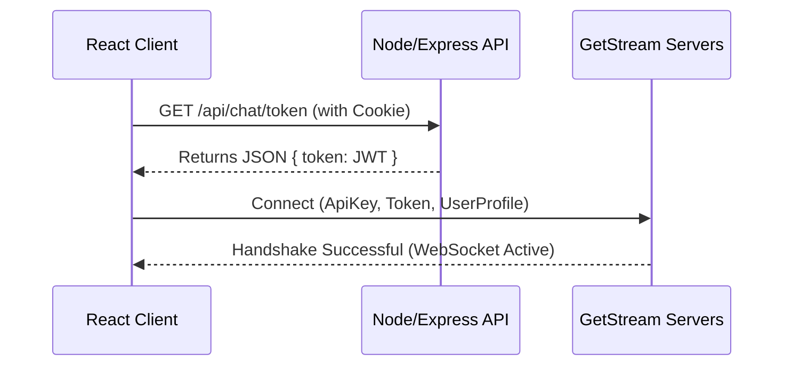

# Realtime Architecture: Converse

This document describes the high-throughput, low-latency realtime architecture of Converse, focusing on WebSocket message propagation, WebRTC call coordination, and client-server state synchronization.

---

## 1. Architectural Topology

Converse achieves real-time interactivity by separating stateful, high-frequency stream events from stateless REST configurations:

```mermaid
graph TD
    subgraph ClientApp [Client Application]
        Zustand[Zustand State]
        RQ[TanStack Query]
        StreamChatSDK[Stream Chat SDK]
        StreamVideoSDK[Stream Video SDK]
    end

    subgraph RestService [API Gateway - Node/Express]
        AuthSvc[Auth/Session Manager]
        UserSvc[User Directory Service]
        RestDBMongoose[(Mongoose ORM)]
    end

    subgraph RealtimeSaaS [GetStream.io Infrastructure]
        WSChatServer[WebSocket Chat Server]
        SFUCalling[WebRTC Selective Forwarding Unit]
    end

    subgraph MainDB [(MongoDB Atlas)]
        MongoDB
    end

    ClientApp -- Cookie-Authenticated HTTPS --> RestService
    RestService -- Query/Persist --> RestDBMongoose
    RestDBMongoose -- Read/Write --> MainDB

    ClientApp -- WebSockets (low latency) --> WSChatServer
    ClientApp -- WebRTC (Peer-to-SFU) --> SFUCalling
```

### Core Architecture Characteristics
1.  **State Separation**: The application database (MongoDB) maintains long-term persistence (profiles, friends, requests, and unread backlogs). High-frequency operations—such as keypresses, message transport, and audio/video signals—are handled directly by GetStream.io's distributed edge servers, avoiding bottlenecks on the Node/Express backend.
2.  **WebSocket Stream**: Used for continuous duplex communication, handling presence, typing states, and message transport.
3.  **WebRTC Stream**: Encrypted audio/video media streams coordinate using the Selective Forwarding Unit (SFU) pattern rather than mesh Peer-to-Peer, drastically saving client upload bandwidth for multi-user calls.

---

## 2. Dynamic Realtime Lifecycle

### A. Session Authentication & Handshake
1.  The client logs into the Express API. The backend returns a signed HttpOnly session cookie.
2.  When navigating to `/chat` or `/call`, the client requests a unique, high-entropy Stream JWT token from `/api/chat/token`.
3.  The client initializes the `StreamChat` or `StreamVideoClient` using the public API Key and signed token, establishing a secure connection to the edge server.



---

## 3. WebRTC Signaling and SFU Topology

For video calling, Converse implements a **Selective Forwarding Unit (SFU)** rather than mesh Peer-to-Peer (P2P). This architecture scales exponentially better:

*   **P2P Mesh (Standard WebRTC)**: Each user must open an upload stream to *every* other participant. For $N$ participants, this requires $N-1$ upload connections and $N-1$ download connections, saturating mobile network bandwidth.
*   **SFU Topology (Converse)**: Each user sends exactly **one** upload media stream to the GetStream SFU. The SFU selectively forwards this stream to other participants. Bandwidth scales linearly, providing clean, high-definition calls on weak networks.

```mermaid
graph LR
    subgraph MeshP2P [Standard Mesh P2P (Bad Scalability)]
        A((User A)) <--> B((User B))
        A <--> C((User C))
        B <--> C
    end

    subgraph SFUTopology [Converse SFU Topology (Highly Scalable)]
        User1((User 1)) -- One Upload --> SFU[GetStream SFU]
        User2((User 2)) -- One Upload --> SFU
        User3((User 3)) -- One Upload --> SFU
        SFU -- Selective Forward --> User1
        SFU -- Selective Forward --> User2
        SFU -- Selective Forward --> User3
    end
```

---

## 4. State Synchronization & Race Conditions

To prevent desynchronized UI indicators or double-hashed connection locks, Converse implements defensive real-time state management:

1.  **Component Mounting Guard**: All asynchronous WebSockets setups use local active lifecycle flags. If a component unmounts while negotiating a connection, the resolved client is immediately torn down before updating React state, preventing crashes.
2.  **Singleton Connection Sharing**: StreamChat instances reuse existing connections if the authenticated user has not changed, avoiding duplicate connection errors.
3.  **Active Watcher Release**: When navigating between chat channels, the client stops watching the prior channel (`channel.stopWatching()`) to release websocket subscriptions and save memory.

---

## 5. Offline Resiliency

Converse implements strict offline handling to guarantee a graceful user experience under poor network connections:

1.  **System-Level Connectivity Tracking**: A global hook (`useOffline`) monitors window connectivity events (`online` / `offline`).
2.  **User-Facing Banner Notifications**: A high-visibility, glassmorphism toast alert blurs onto the screen when connection is lost, warning the user that messages are not sending.
3.  **Automatic Reconnect & Catchup**: Once the network recovers, the GetStream SDK automatically reconnects the WebSocket connection and fetches any messages missed during the downtime.
