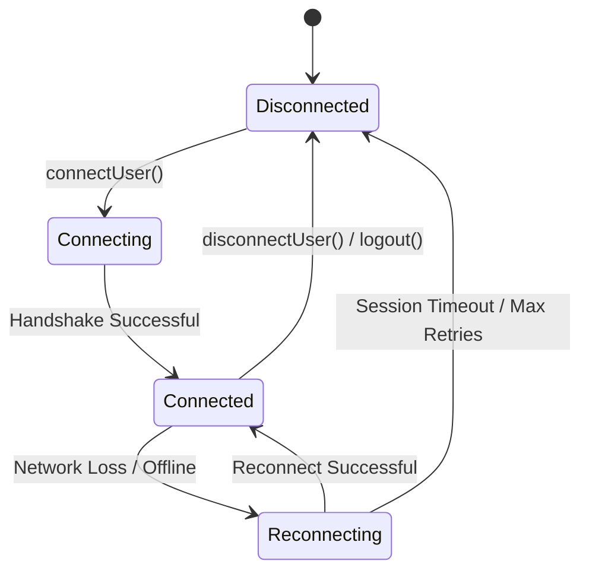

# WebSocket Connection Lifecycle: Converse

This document defines the lifecycle, state transitions, event notifications, and cleanup guidelines for Converse's WebSocket architecture.

---

## 1. WebSocket State Flow

Converse's chat functionality relies on a persistent WebSocket connection managed by the Stream Chat client. The connection moves through the following states:



### State Descriptions
*   **Disconnected**: No socket is active. This is the default state on public routes like Login, Signup, and Password recovery.
*   **Connecting**: An asynchronous connection attempt is in progress. The user's JWT token is transmitted for authentication.
*   **Connected**: Handshake is complete. Real-time message exchange, typing states, and presence tracking are active.
*   **Reconnecting**: The client lost connectivity. The SDK attempts to re-establish connection using exponential backoff while caching offline actions.

---

## 2. Step-by-Step Connection Lifecycle

### A. Initialization and Connection Guard
When `ChatPage` mounts, it instantiates the connection. To prevent duplicate connection attempts or timing race conditions, Converse implements the following guard in `ChatPage.jsx`:

```javascript
const client = StreamChat.getInstance(STREAM_API_KEY);

// Guard: If switching logged-in users, tear down the previous user's socket first
if (client.userID && client.userID !== authUser._id) {
  await client.disconnectUser();
}

// Guard: Only connect if not already connected
if (!client.userID) {
  await client.connectUser(
    {
      id: authUser._id,
      name: authUser.fullName,
      image: authUser.profilePic,
    },
    tokenData.token
  );
}
```

### B. High-Frequency Realtime Signaling (Typing Indicators)
To prevent network congestion from keypress events, typing indicators are debounced. 
1.  When a user starts typing, the client emits `typing.start` event.
2.  Typing events are rate-limited/debounced using timer intervals (e.g. only emitting updates every 3000ms).
3.  If no input is detected for 5000ms, the client emits `typing.stop` event.

### C. Active Watcher Release & Tear Down
Leaving a chat page without cleaning up keeps the WebSocket listening for active messages in that channel, leaking memory. Converse enforces proper unwatch teardowns on component unmount:

```javascript
return () => {
  active = false;
  if (currChannel) {
    currChannel.stopWatching().catch(err => 
      console.error("Error stopping channel watcher on unmount:", err)
    );
  }
};
```

---

## 3. Realtime Socket Event Map

| Event Name | Trigger Source | Payload Details | Client Response |
| :--- | :--- | :--- | :--- |
| `message.new` | Peer sent a message | `message` object, `channel_id` | Renders message in stream; plays notification sound; increments unread counter. |
| `typing.start` | Peer starts entering input | `user_id`, `channel_id` | Renders "... is typing" placeholder. |
| `typing.stop` | Peer stops entering input | `user_id`, `channel_id` | Hides typing placeholder. |
| `user.presence.changed`| Peer goes online/offline | `user` object, `status` | Updates online indicator lights in sidebar and friends grid. |
| `connection.changed` | Network connectivity shift | `online` boolean | Toggles global offline banner notification. |

---

## 4. Troubleshooting Reconnection Stutters

*   **Console Warning**: `connectUser was called but client is already connected`
    *   *Cause*: Hot-reloads in development or navigating between routes re-runs the connection logic.
    *   *Fix*: The connection guard implemented above prevents calling `connectUser` again if the `userID` is already set.
*   **Messages Sent Offline are Lost**:
    *   *Cause*: The user has weak connectivity, and the REST API request fails.
    *   *Fix*: The Stream SDK caches failed messages locally, showing an error icon next to them with a retry action link.
